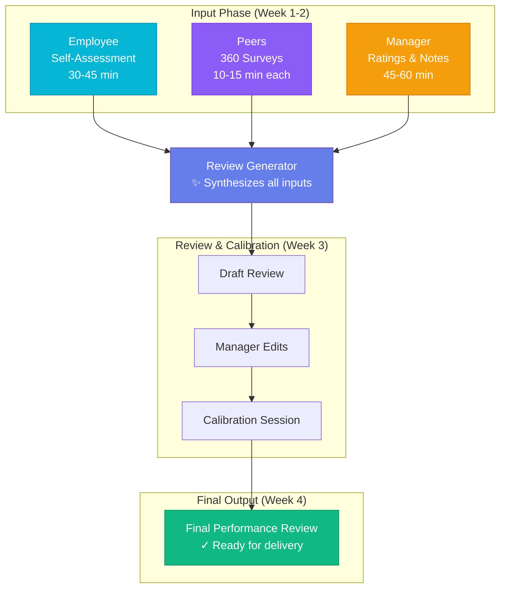

# Performance Review Process Guide

## Our Goals

This performance management system is designed to achieve two primary objectives:

### 1. Save Everyone's Time

Nobody enjoys the traditional review process. It's time-consuming, stressful, and often feels like busy work. We've redesigned the process to be:

- **Faster** - Streamlined inputs, AI-assisted outputs
- **Focused** - Clear criteria, no guesswork
- **Efficient** - Multiple choice where possible, narrative where it matters

### 2. Provide Unbiased, Actionable Feedback

Reviews should help people grow, not just document the past. Our AI-assisted approach:

- **Reduces bias** - Structured criteria and evidence-based ratings
- **Ensures consistency** - Same standards applied across the organization
- **Focuses on growth** - Clear development paths, not just scores
- **Synthesizes input** - Combines multiple perspectives into coherent feedback

---

## Process Flow Diagram

Here's how the review process works:

**View the interactive diagram:** [Open process-flow.html](../mockups/process-flow.html) in your browser for a detailed visual representation.

---

## Time Commitment Overview

| Step | Who | Time Required | When |
|------|-----|---------------|------|
| Self-Assessment | Employee | 30-45 minutes | Week 1 |
| 360 Surveys | Peers (3-5 people) | 10-15 minutes each | Week 1-2 |
| Manager Review | Manager | 45-60 minutes per report | Week 2-3 |
| Calibration | Managers + Leadership | 2-3 hours (group session) | Week 3 |
| Delivery Meeting | Manager + Employee | 30-45 minutes | Week 4 |

**Total time per employee:**
- **Employee**: ~1 hour (self-assessment + delivery meeting)
- **Peers**: 10-15 minutes per survey
- **Manager**: ~1.5 hours per direct report

---

## The Complete Process

### Phase 1: Self-Assessment (Employee)
**Time: 30-45 minutes**

Employees complete a self-assessment covering:
- Universal criteria (Craft/Quality, Speed, Adaptiveness)
- Role-specific competencies
- Key accomplishments
- Areas for growth
- Career goals

**Why this matters:** Your perspective is essential. You know your work better than anyone. The self-assessment ensures your voice is part of the review.

**Tips for a good self-assessment:**
- Be honest about both strengths and growth areas
- Provide specific examples with outcomes
- Don't undersell yourself, but don't oversell either
- Think about what you want to work on next

---

### Phase 2: 360 Feedback Surveys (Peers)
**Time: 10-15 minutes per survey**

Peers complete quick surveys about colleagues they've worked with:

**Multiple Choice Questions** (fast):
- Collaboration effectiveness
- Communication quality
- Technical contribution
- Reliability

**Brief Narrative Questions** (focused):
- "What does this person do well?" (2-3 sentences)
- "What could they improve?" (2-3 sentences)
- "What impact have they had on you or your team?" (2-3 sentences)

**Why we use this format:**
- Multiple choice is fast and provides quantitative data
- Short narratives capture the nuance without requiring essays
- Structured questions ensure useful, comparable feedback

**Tips for giving good feedback:**
- Be specific - examples are more helpful than generalities
- Be constructive - focus on behaviors, not personality
- Be honest - sugarcoating doesn't help anyone grow

---

### Phase 3: Manager Review (Manager)
**Time: 45-60 minutes per direct report**

Managers use the review tool to:

1. **Review Inputs**
   - Read employee's self-assessment
   - Review 360 feedback from peers
   - Reflect on their own observations

2. **Rate Criteria**
   - Use sliders to set 1-4 ratings
   - Add manager notes for each criterion
   - Select and rate role-specific competencies

3. **Generate Review**
   - AI synthesizes all inputs into a draft review
   - Manager reviews and edits the generated content
   - Finalize development plan for any 3-rated areas

**How AI Helps Managers:**
- **Saves time**: Turns bullet points into polished paragraphs
- **Reduces blank page syndrome**: Provides a starting draft to edit
- **Ensures completeness**: Covers all required sections
- **Maintains consistency**: Same structure across all reviews
- **Synthesizes 360 feedback**: Incorporates peer perspectives coherently

**Important:** AI generates a draft. Managers should always review and personalize the content. The AI doesn't know your employee like you do.

---

### Phase 4: Calibration Session (Managers + Leadership)
**Time: 2-3 hours (group session)**

Managers meet to ensure consistency across the organization:

**Purpose:**
- Ensure same standards are applied across teams
- Challenge assumptions and check for bias
- Share context that might affect ratings
- Finalize ratings before delivery

**Process:**
1. Each manager presents their ratings (briefly)
2. Group discusses any outliers or questions
3. Ratings are adjusted if needed based on discussion
4. Final approval before employee delivery

**Questions asked in calibration:**
- "Would this person get the same rating with a different manager?"
- "Is the evidence sufficient to support this rating?"
- "Are we applying the same standard as last cycle?"

---

### Phase 5: Review Delivery (Manager + Employee)
**Time: 30-45 minutes**

Manager meets with employee to discuss the review:

**Agenda:**
1. Share overall assessment and ratings
2. Discuss strengths and accomplishments
3. Review development areas and plan
4. Discuss career goals and next steps
5. Answer questions and discuss feedback

**Tips for a good delivery meeting:**
- No surprises - ratings should align with ongoing feedback
- Focus on the future, not just the past
- Listen as much as you talk
- End with clear next steps

---

## How AI Supports the Process

### What AI Does

| Task | How AI Helps |
|------|--------------|
| **Synthesize feedback** | Combines self-assessment, 360 feedback, and manager notes into coherent narrative |
| **Generate review draft** | Creates polished paragraphs from bullet points and ratings |
| **Ensure completeness** | Checks all required sections are addressed |
| **Maintain structure** | Consistent format across all reviews |
| **Create development plans** | Suggests specific actions for improvement areas |

### What AI Doesn't Do

- **Replace manager judgment** - You set the ratings, AI helps write them up
- **Add information** - AI only uses what you provide
- **Make decisions** - Compensation and promotion decisions are human decisions
- **Know your employee** - Only you have the context and relationship

### Why AI-Assisted Reviews Are Better

**More Consistent**
- Same structure and standards across all reviews
- Reduces variation from writing ability differences

**Less Biased**
- Structured criteria reduce subjective bias
- Multiple inputs (self, peers, manager) triangulate performance

**Higher Quality**
- Well-written, professional documents
- Comprehensive coverage of all criteria

**More Actionable**
- Clear development plans
- Specific, behavioral feedback

---

## Frequently Asked Questions

### "Will AI write my review for me?"

No. AI generates a draft based on your inputs - ratings, notes, and the employee's self-assessment and 360 feedback. You should always review and edit the content. Think of it like having a first draft to work from instead of a blank page.

### "How do I know the AI isn't biased?"

The AI doesn't make rating decisions - you do. It simply turns your ratings and notes into well-written paragraphs. The structured criteria and multiple inputs (self, peer, manager) help reduce bias in the overall process.

### "What if I disagree with the AI-generated content?"

Edit it! The generated content is a starting point. Add, remove, or rewrite anything that doesn't match your assessment. You know your employee better than any AI.

### "Is my feedback data private?"

Yes. Feedback data is used only for the review process. Individual 360 responses are aggregated and anonymized when presented to the employee.

### "Can employees see the raw 360 feedback?"

Employees see synthesized feedback, not raw individual responses. This encourages honest feedback while still providing value to the employee.

---

## Timeline Example

**H2 2024 Review Cycle**

| Week | Activity |
|------|----------|
| Week 1 (Jan 6-10) | Self-assessments open, 360 surveys sent |
| Week 2 (Jan 13-17) | Self-assessments due, 360 surveys due |
| Week 3 (Jan 20-24) | Managers complete reviews |
| Week 4 (Jan 27-31) | Calibration sessions |
| Week 5 (Feb 3-7) | Review delivery meetings |

---

## Getting Started

### For Employees
1. Complete your self-assessment when notified (30-45 min)
2. Complete 360 surveys for colleagues (10-15 min each)
3. Prepare questions for your delivery meeting

### For Managers
1. Remind direct reports about self-assessments
2. Identify 3-5 peers for each direct report's 360
3. Block time for review writing (45-60 min per report)
4. Prepare for calibration session
5. Schedule delivery meetings

### For HR/Leadership
1. Set timeline and communicate to organization
2. Ensure rubrics are updated for all roles
3. Schedule calibration sessions
4. Monitor completion rates
5. Collect feedback for process improvement

---

## Support

Questions about the process? Contact:
- Your manager (first stop)
- HR partner
- Performance Management team

Remember: The goal is to help everyone succeed. If something isn't working, let us know so we can improve it.
